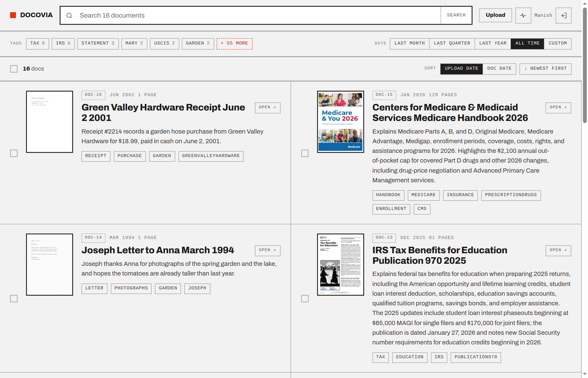
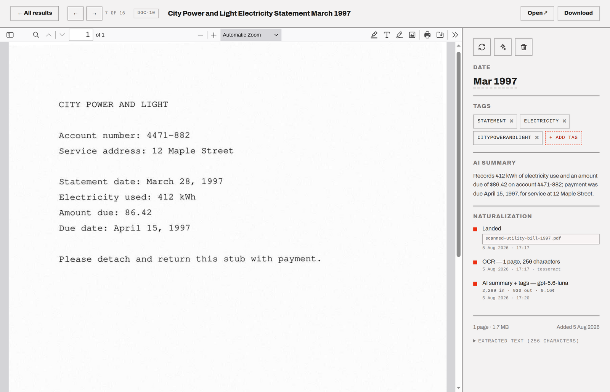
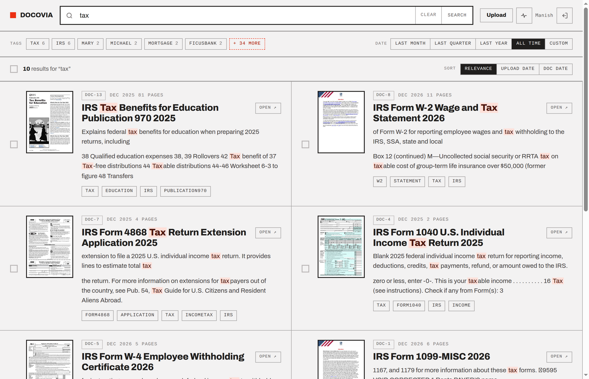

# Docovia - The Land For Docs

A self-hosted document archive: drop files in, get them OCR'd, titled, tagged,
dated and searchable. Go and Typesense, no database, and the JSON sidecars next
to your documents are the source of truth.



*The archive in these screenshots is demo data — public-domain government
documents, the CFPB's deliberately fictional mortgage samples, and two
fabricated "scans" — so what you see is exactly what the pipeline produced,
with nobody's real paperwork on display.*

## Origin

First, I (Manish) would like to thank paperless-ngx. I self-host it and it got
me away from the control of Dropbox and Google Drive, and showed me what's
possible.

After months of usage, I grew unhappy with paperless-ngx: search was slow,
the quality of results was bad, and the whole interface felt oldschool and
buggy.

My first attempt was to run Typesense search over paperless-ngx, which produced
remarkably better results. Emboldened by that, I decided to build Docovia from
scratch.

I used Claude to co-author it over a busy family-oriented weekend and 3
weekdays. My prime focus was on Design, UI/UX over both desktop and mobile,
enrichment (LLM) and search quality. I didn't get a lot of time to do thorough
code reviews upfront, which I paid for later, untangling some of the complexity
the coding agent brought.

## Naturalization Process

Docovia is great because you can just dump your documents without worrying about
any folder level organization. Once uploaded, Docovia would process a doc as
follows:

1. Check for duplicates via SHA checksum and reject if it finds one.
1. Unlock if locked, trying every known password from previous successful
   unlocks. Overwrite the original with this unlocked version, while
   keeping the original's checksum to catch duplicates.
1. Extract text, either by reading the native text layer or running OCR over
   them.
1. Send extracted text to LLM (OpenAI) to determine title, document
   date, tags and summary.
1. Index the doc in Typesense, which holds everything in RAM - search is
   instant, scored and full-text.
1. The Doc is now fully naturalized citizen of Docovia. Welcome!



The UX of Docovia supports text search, tag filters and sort by upload date and
document date. If a doc is trashed, it stays put for the next 30 days but
disappears from search results, after which everything about the doc gets
permanently deleted.



What Docovia doesn't provide is any access control. If you can access Docovia,
you can access all available docs.

## Install and Run

Docker is the recommended deployment mechanism for Docovia. The Docker image
carries everything the pipeline shells out to — ocrmypdf, Tesseract,
Ghostscript, poppler, qpdf, ImageMagick, LibreOffice — and runs Typesense
alongside docovia inside the same container. That is deliberate: Typesense keeps
no state here, the index is rebuilt from the sidecars on every boot.

```sh
# From Docovia git repo
docker build -t docovia .

# Create ~/docovia-data and ~/.config/docovia/config

docker run -d --init --name docovia --restart unless-stopped \
  -p 127.0.0.1:8080:8080 \
  -v ~/docovia-data:/data \
  -v ~/.config/docovia/config:/etc/docovia/config:ro \
  docovia
```

Then http://localhost:8080, drop files into `~/docovia-data/ingest/`, or upload
via the web interface.

Four details in that command are load-bearing:

**`-p 127.0.0.1:8080`** — without `oidc_issuer` in the config, docovia has no
authentication: anything that can reach the port can read, download, edit and
delete every document, so publish it to loopback and put an authenticating
proxy in front. It logs this warning at every start, on purpose. With OIDC
configured (below), every request requires login and publishing wide is the
point.

**`--init`** — the pipeline spawns ocrmypdf and Ghostscript. If docovia dies
mid-OCR, those need a real PID 1 to reap them.

**`-v ~/docovia-data:/data`** — the whole archive: your originals, the derived
PDFs, thumbnails, the JSON sidecars, the journal and the PDF password file. Back
up this one directory and you have backed up everything.

**`-v ~/.config/docovia/config:...:ro`** — the config file, which is the whole
configuration: the OpenAI key, the OIDC settings, everything. Read-only, and a
mount rather than `-e` variables, because a variable set at `docker run` is
written into the container's config on disk and stays visible to
`docker inspect` for as long as the container exists. Without a config
everything still ingests and is searchable; documents just keep
filename-derived titles and no tags.

You do **not** need to pass `TYPESENSE_API_KEY`. The entrypoint generates one
from `/dev/urandom` at start and hands it to both processes through the
environment.

### Config

Flat `key = value`, `#` comments. Looked for at `~/.config/docovia/config`,
then `/etc/docovia/config` (which is where the mount above lands), or wherever
`-config` points. Every flag is also a config key — dashes become underscores —
and a flag given on the command line beats the config. A key the program does
not know refuses to start, naming the line, so a typo cannot silently mean
nothing.

Every key, with its default where one exists. Commented lines are what you get
without them; the uncommented three are a typical prod config in full:

```
# ~/.config/docovia/config           chmod 600 — it holds keys

# LLM Settings
openai_key = sk-...        # without it: no titles, no tags
# llm = true               # false ingests without the model at all
# llm_model = gpt-5.6-luna # defaults to gpt-5.6-luna
# enrich_workers = 16      # concurrent model calls; defaults to half the cores

# Doc Processing
# ingest_workers = 16      # concurrent ocrmypdf calls, defaults to half the cores

# Auth
# oidc_issuer = https://id.example.com
# oidc_client_id = docovia
# oidc_client_secret =               # only for a confidential registration

# Web
listen = 127.0.0.1:8080 # the container's command line passes 0.0.0.0:8080
# public_origin =       # e.g. https://docovia.example.com, behind a TLS proxy
# read_only =           # true rejects every change from the web — for a public demo

# Data
# data = /home/you/docovia-data      # the container's command line passes /data
                                     # (no ~ expansion — spell paths out)
# pdf_passwords =                    # default <data>/passwords

# Typesense (Optional)
# typesense_url = http://localhost:8108
# typesense_key = docovia-dev-key
# collection = documents             # give a second instance its own

# Dev Mode
# dev = false                        # reload templates and static from disk
```

In the container, `data` and `listen` are already answered by the image's
command line — flags beat config — so a mounted config that sets them changes
nothing there, and the same file therefore serves a native dev run unchanged.

`openai_key` and `oidc_client_secret` are also flags for uniformity's sake,
but put them here: argv is public — `ps` prints it to every user on the
machine, and `docker inspect` keeps it for the life of the container.

### Note about LLM Enrichment

Docovia supports OpenAI for LLM enrichment because the Luna model is remarkably
cheap. Docovia truncates (from middle, leaving head and tail intact) and sends a
doc's extracted text and gets metadata: title, date, tags, and summary back. It
does NOT send the doc to be OCR'd by LLM which would be more expensive. Instead,
it relies entirely on local tools for text extraction.

Docovia stores the LLM tokens in, out and cost in each doc's JSON sidecar. So
it's able to accurately tell how much it spent on processing the docs. With this
mechanism, after processing 8.5K docs, I'm seeing an average cost of 1/10th of a
cent per doc, overall costing me ~$10, as per Docovia's status page. Not bad!

The docs become searchable the moment they're processed, even before LLM runs.
So LLM enrichment can be turned off as well, in which case, the doc would remain
with the original file name as the title, no doc date, tags or summary. All of
those fields, except summary, can be manually edited at any time.

### Login, via OIDC

Set `oidc_issuer` and `oidc_client_id` and every request requires login; set
neither and behavior is exactly the pre-OIDC arrangement, loopback warning
included. Any OIDC provider works; the one I run and recommend is
[Pocket ID](https://pocket-id.org) — a single small container, passkey-only
so there are no passwords to phish or reuse, and per-app allowed groups to
decide who gets in. To wire it up:

1. Create an OIDC client there. **Public client** with PKCE — no secret needed.
2. Register the callback URL: `http://your-host:8080/auth/callback` (one per
   origin you browse from; the scheme and host are taken from the request, so
   it works on a LAN address and behind a TLS proxy alike).
3. Put the issuer URL and client id in the config.

Who may log in is the issuer's decision — Pocket ID's allowed-groups per app —
not docovia's; there is no user table here. Sessions are HMAC-signed cookies,
30 days, renewed by use; signing out clears only docovia's session, so with
the issuer's own session still alive, signing back in is one passkey tap.
Deleting `<data>/session.key` signs everyone out at once.

### TLS, via Caddy

OIDC answers who is asking; TLS keeps the documents — and the session cookie —
private on the wire. For production, I recommend putting
[Caddy](https://caddyserver.com) in front. It obtains
and renews SSL certs from Let's Encrypt automatically. The entire Caddyfile:

```
docovia.example.com {
	reverse_proxy 127.0.0.1:8080
}
```

That is not abbreviated. By default Caddy redirects HTTP to HTTPS, passes the
`Host` header through, and adds `X-Forwarded-Proto` — which are exactly the
three things Docovia wants from a proxy. The OIDC callback derives itself as
`https://docovia.example.com/auth/callback` (register that one in Pocket ID) and
the session cookie turns `Secure` without being told. With nginx or Traefik
you get to configure those headers by hand.

Two details close the loop. Keep the container published to `127.0.0.1:8080`
as in the run command above, so Caddy's port 443 is the only door in from
outside. And set

```
public_origin = https://docovia.example.com
```

in the config, which the cross-site request guard uses as its `Origin`
fallback for browsers too old to send `Sec-Fetch-Site`.

Pocket ID for who, Caddy for the wire, loopback so the proxy is the only way
in — that trio is the production setup.

### Checking it came up

```sh
docker logs docovia | head -20
```

```
config loaded from /etc/docovia/config
5 PDF password(s) loaded from /data/passwords
metadata enrichment on, model gpt-5.6-luna
every request requires login via https://id.example.com (public client with PKCE)
indexed 1063 documents from /data/docs
listening on http://0.0.0.0:8080
```

If a line reads `no openai_key in the config`, the config mount did not land.
If `indexed 0` is wrong for your archive, neither did the data mount.

### The archive on disk

```
~/docovia-data/
  ingest/       drop files here; the watcher waits for the size to settle
  originals/    exactly what arrived — the preservation copy
  archive/      derived PDF/A with a text layer — reproducible by re-running OCR
  thumbs/       first-page JPEGs
  docs/         one JSON sidecar per document; the source of truth
  journal.jsonl what happened to what, and what it cost
  passwords     0600, one password per line
  session.key   0600, signs login cookies; delete it to sign everyone out
```

Back up the entire data directory. You could save space by backing up only
`originals`, `docs` and `passwords` — search and metadata restore whole from
the sidecars — but every document's PDF view and thumbnail would then be gone
until you hit Reprocess on it, which also re-runs the model. Derived data
costs about as much as the originals; back it all up.

Use [restic](https://restic.net): it encrypts everything client-side before
upload and deduplicates, so the nightly run ships only what changed. One-time
setup — create a Backblaze B2 bucket and an application key scoped to it, put
a strong password in `~/.config/docovia/restic-pass` (chmod 600), then run
`restic init` with the same variables as below. That password *is* the
encryption: keep a copy of it somewhere that is not this machine, or the
backup is noise.

```sh
#!/bin/sh -e
# ~/bin/docovia-backup — nightly, from cron or a systemd timer
export RESTIC_REPOSITORY=s3:s3.us-west-004.backblazeb2.com/your-bucket
export RESTIC_PASSWORD_FILE=$HOME/.config/docovia/restic-pass
export AWS_ACCESS_KEY_ID=your-b2-key-id        # B2 calls it keyID
export AWS_SECRET_ACCESS_KEY=your-b2-app-key   # and applicationKey

restic backup $HOME/docovia-data
restic forget --keep-daily 7 --keep-weekly 4 --keep-monthly 12 --prune
```

The S3 endpoint is on your bucket's page in the B2 console — `us-west-004`
above is just an example. A crontab line to run it at 3am:

```
0 3 * * * $HOME/bin/docovia-backup
```

Restoring is two steps: `restic restore latest --target /` puts the directory
back where it was, and starting the container does the rest — the index
rebuilds from the sidecars on boot, so there is no import step to remember.

## Developing

Typesense from compose, docovia natively, templates and static files read from
disk so an edit is a browser reload rather than a rebuild:

```sh
docker compose up -d           # Typesense on 127.0.0.1:8108
go build -o docovia . && ./docovia -dev
```

Go changes need the rebuild; HTML, CSS and JS do not. The defaults already
point at that Typesense and at `~/docovia-data`, and the same
`~/.config/docovia/config` the container mounts is read natively — so one
config serves both, with dev flags beating it where they differ.

Native development is only as faithful as the host's tools, and the image pins
them for a reason — a spreadsheet will fail to convert on a machine that has
`libreoffice-writer` and not `libreoffice-calc`, and Tesseract versions differ by
a few characters on the same scan. When something behaves oddly, the container is
the reference.

```sh
go test ./...
go test -race ./...
```
